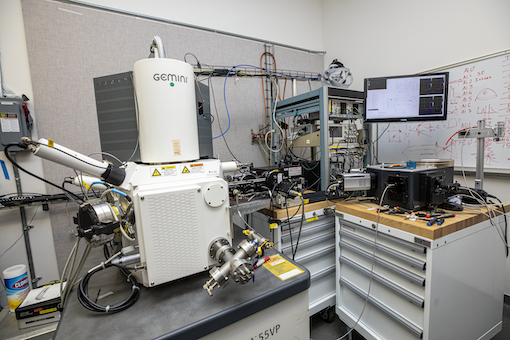
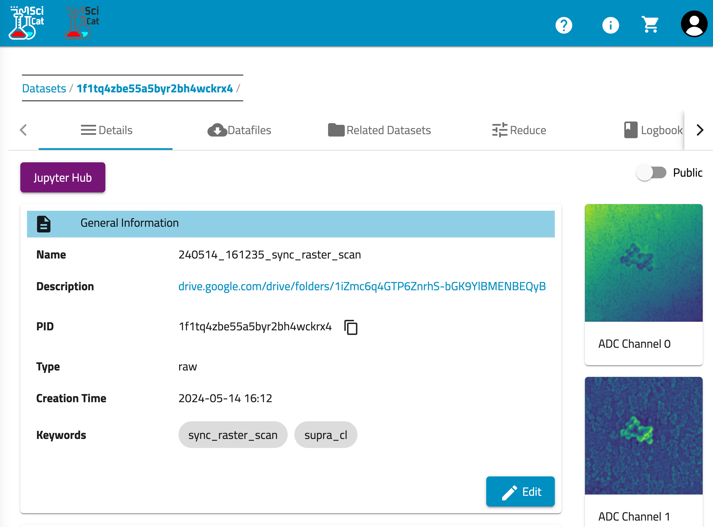

+++
title = 'SupraCL'
Summary = "Custom Cathodoluminescence (CL) Scanning Electron Microscope (SEM)"
header_image = "/instruments/SupraCL/supracl-photo.png"
+++

# Hardware

**Zeiss Gemini Supra 55 VP Scanning Electron Microscope**

This microscope is used for imaging and analysis of conducting and insulating samples. The SEM has multiple detectors including in-lens and conventional secondary electron detectors, in-lens and quadrant backscatter detectors, an EDS system for elemental x-ray analysis, and a transmission (STEM) bright/dark field detector compatible with standard TEM grids. Beam energy is variable between 100 eV and 30 kV, with 1 nm resolution above 2 kV and several nm resolution at 100 eV. A range of sample holders are available including standard SEM stubs, wafers to 4″, flat, tilted and cross section holders for wafer pieces, and for TEM grids.

## Processing and Analysis 

### Sync Raster Scans in Crucible

