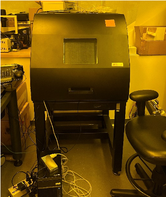
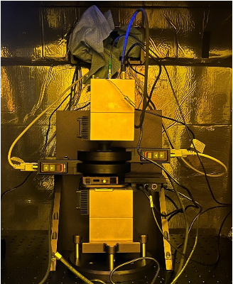
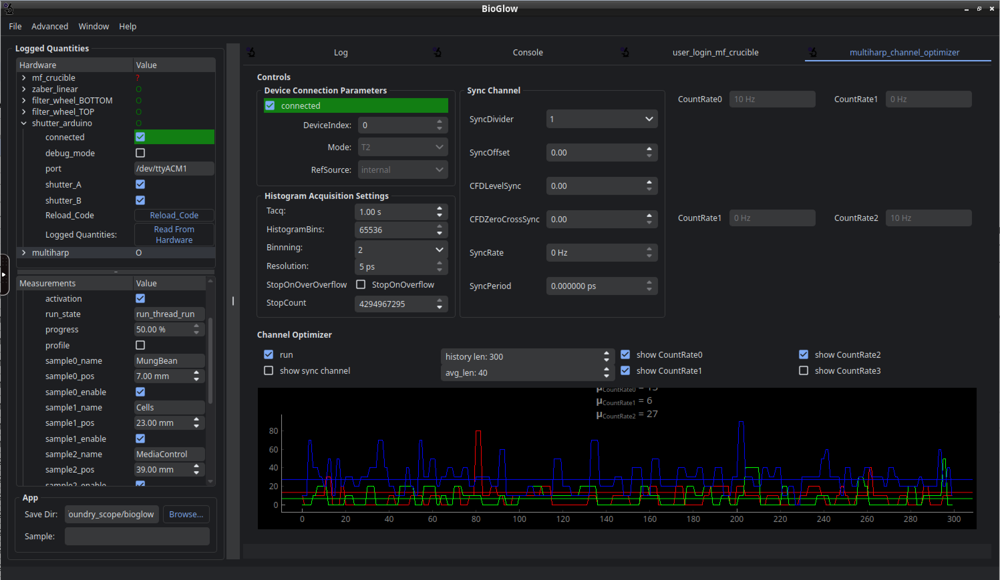
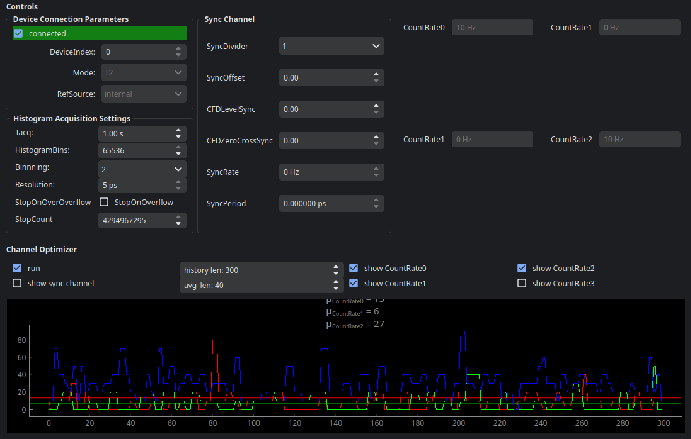
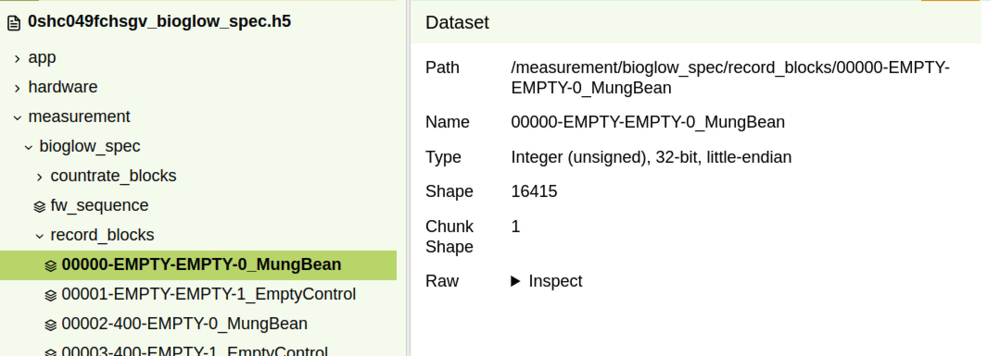
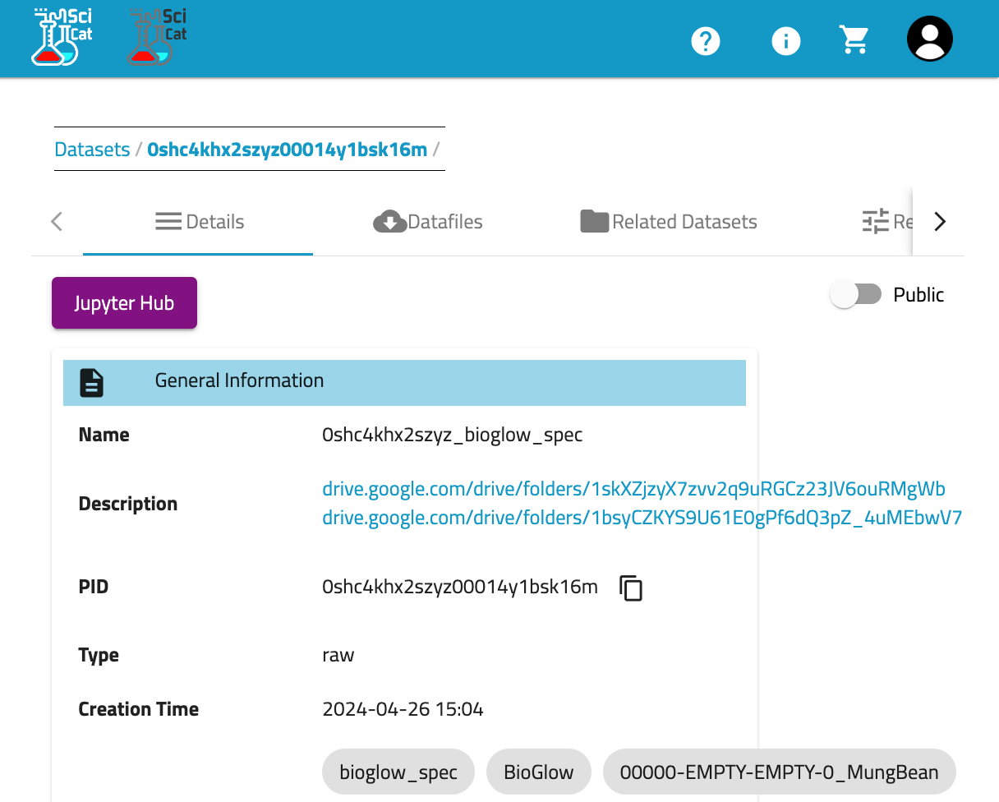

+++
title = 'BioGlow'
Summary = "Capturing biological Ultra-Weak Photon Emission"
header_image = "/instruments/bioglow/image-1.png"
+++

# BioGlow
*Capturing biological Ultra-Weak Photon Emission*

**Foundry Scientist:** Aeron T Hammack

**Super User:** Rhys Mould

## Science

All cells spontaneously release extremely low levels of light, a phenomenon known as Ultra-Weak Photon Emission (UPE). These photons are byproducts of excited Reactive Oxygen Species (ROS), themselves byproducts of cellular metabolism. As such, the intensity of emission is tied to the cell’s metabolic state, meaning UPE could facilitate previously unknown light-based signalling pathways. However, study of UPE is made challenging because of the low intensities: 1--1000 photons per second per cm2. 

## Hardware

The BioGlow system, pictured, is designed to capture and study the UPE phenomena in detail. Contained with a dark box to prevent exogenous light interference (left image), the BioGlow is a programmable, automated system consisting of two Peltier-cooled low dark count PMTs (right image) to measure both total photon output and spectrally resolved emission. An automated stage allows multiple samples to be analysed in a single experiment. A MultiHarp time correlated single photon counter also provides time tagging photon arrival, enabling users to investigate potential photon bunching, which may imply quantum phenomena occurring within a biological system. Wavelength filtering with Bandpass filters on PMT A allow for spectrally-resolved measurements of UPE.

 

## Software

### Computer

bioglow.dhcp.lbl.gov running NixOS Linux with Dockerized KasmVNC container with python, ScopeFoundry and VSCode.

Access via Docker Container KasmVNC at https://bioglow.dhcp.lbl.gov:3001 

BioGlow software is a [ScopeFoundry](http://www.scopefoundry.org) instrument

Git Repo on BitBucket: https://bitbucket.org/berkeleylab/foundry_scope/src/bioglow/

Cloning software: 

    `git clone -b bioglow https://bitbucket.org/berkeleylab/foundry_scope.git`

## Experiment Types 

### MultiHarp Channel Optimizer

`multiharp_channel_optimizer`

ScopeFoundry measurement to visualize count rates

### MultiHarp T2

### BioGlow Spectral Collection

`bioglow_spec`

Loops through up to 4 sample positions, 11 spectral windows and collects photons on both PMTs for a set amount of time for each sample and spectral "block". Output file is an HDF5 file that stores both time-stamped count rates  as well as raw MultiHarp T2 style photon event records for each block. Each block is addtionally saved as its own HDF5 file for backup.

## Processing and Analysis

### BioGlow Spectral datasets in Crucible

`bioglow_spec` datasets are automatically ingested into [Crucible](https://crucible.lbl.gov) and can be viewed on [SciCat](https://mf-scicat.lbl.gov) or accessed via Google Drive.

### Automated Crucible event record parsing

Coming Soon!

### Jupyter Notebooks for Count rate analysis

Coming Soon!
