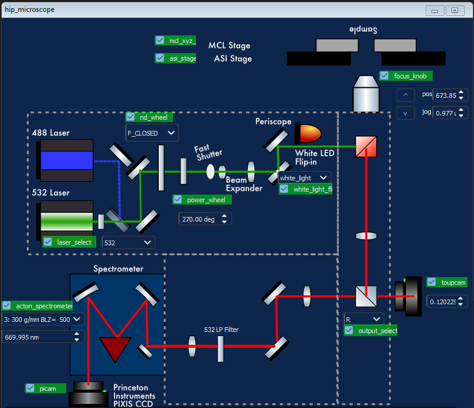
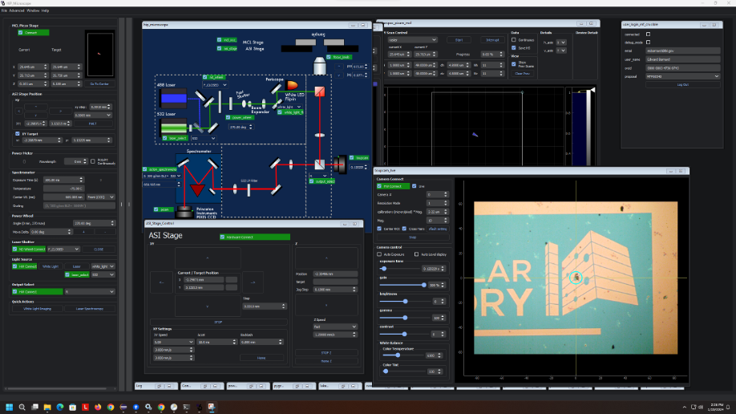
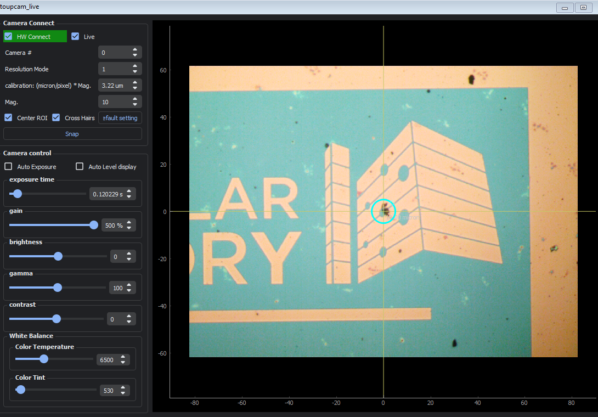

+++
title = 'HiP Raman/PL Microscope'
Summary = 'Raman/PL mapping confocal optical microscope'
header_image = "/instruments/hip_microscope/hip-hardware-config.png"

+++

# HiP Microscope

*Raman/PL mapping confocal optical microscope*

This custom optical microscope can acquire

**Foundry Scientist:** Edward Barnard

## Science

## Hardware

Custom optical microscope built out of Nikon Eclipse inverted microscope body with motorized sample positioning stage. Excitation from white light LED or 300mW 532 nm diode laser. Collection via Amscope CMOS camera (for inspection) and Princeton Instrument SP300i Spectrometer and Pixis CCD for spectral detection. Most components are motorized for remote operation.

Schematic of microscope:

## Software

{.img-fluid}

### Computer

hip-microscope2.dhcp.lbl.gov running Windows 11. Remote access via Microsoft Remote Desktop (RDP)

## Experiment Types 

### Toupcam Live Image view

`toupcam_live`

Live imaging on AMScope (`toupcam`) camera for viewing whitelight images of sample or laser alignment.

{.img-fluid}

### High Resolution Hyperspectral Raman/PL mapping with Piezo

`hyperspec_picam_mcl`

<video class=".img-fluid" controls src="02-data-acquisition-20x.mp4" title="hyperspec_mcl_picam data acquisition"></video>

### Large-area Hyperspectral Raman/PL mapping with ASI stage
`picam_asi_hyperspec_scan`

Same as `hyperspec_mcl_picam` but uses coarse positioner `asi_xyz_stage` to scan. This will give you a much larger scan area (10 mm vs 50µm) at the cost of reduced spatial resolution (best positioning accuracy around 1µm)

### Laser Annealing of Qubits

