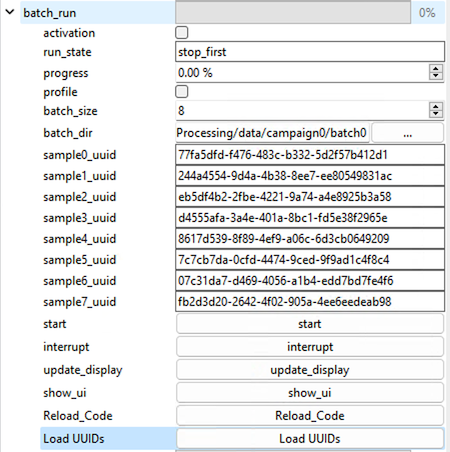

+++
title = 'SpinBot'
Summary = 'Robotic Spin-coating synthesis platform'
header_image = "/instruments/spin-bot/spinbot_overview.png"

+++

# SpinBot

*An automated platform for the synthesis and characterization of solution processed thin films*

**Foundry Scientist:** Carolin Sutter-Fella

## Hardware

* Fully automated spin coating platform:
    * Dobot M1
    * pipette robot
    * spin coaters
    * 1.5×1.5 mm2 substrates
    * hotplate
    * heatable solution shakers
    * characterization box
    * antisolvent and gas quenching units
* Inline optical characterization (UV-vis absorption and photoluminescence)
* Serves the increasing demand for high-throughput experimentations in the field of solution processed semiconductors like lead halide perovskites
* High level of process flexibility and reproducibility of results
* Atmosphere condition
* User friendly GUI to plan and execute experiments

### TEC programmable heater system

PLC-controlled 8-way heater/cooler system for setting custom annealing profiles.

## Software

### SpinBot One Control software (LabView)

In order to coordinate LabView and ScopeFoundry software, a TCP socket between software is established

### Characterization Software (ScopeFoundry)

#### Spec Run

`spec_run`

Run the full characterization suite: PL, white-light transmission, and photograph for a single sample.

#### TEC heater batch program 

#### Batch Run

Peform a batch run of 8 samples coordinated with the SpinBot Labview software. Configuration of this experiment is in JSON files stored in batch directory. 

## Processing and Analysis

### SpecRun in Crucible 
`spec_run` datasets are automatically ingested into [Crucible](https://crucible.lbl.gov) and can be viewed on [SciCat](https://mf-scicat.lbl.gov) or accessed via Google Drive.

### Jupyter Notebooks for SpecRun analysis

Coming Soon!
