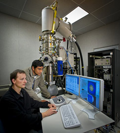
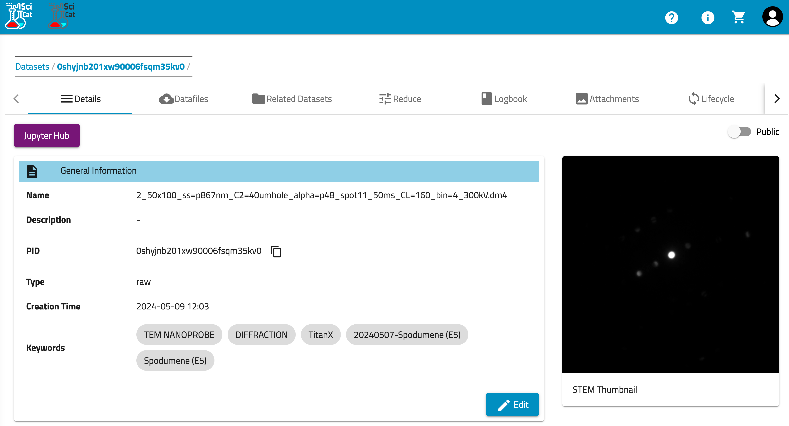

+++
title = 'TitanX'
Summary = "Capturing biological Ultra-Weak Photon Emission"
header_image = "/instruments/titanx/titanx-photo.png"
+++

## Hardware

The uncorrected FEI TitanX 60-300 microscope at NCEM is equipped to do fast energy dispersive X-ray mapping (EDS), 4D-STEM, S/ TEM imaging and tomography.  All TEM holders that are compatible with FEI microscopes can be used for heating, cooling and other in-situ experiments. The ability to switch between 60, 80, 120, 200, and 300kV during one TEM session gives the user flexibility to optimize experimental conditions – balancing sample damage, spatial resolution, and signal-to-noise.

https://foundry.lbl.gov/instrumentation/titanx/

### Computers

#### Microscope PC
Windows 7

#### Camera PC 
Windows 10

## Software

### Crucible Login

## Processing and Analysis 

### DM4 files in Crucible

`DM4` STEM datasets are automatically ingested into [Crucible](https://crucible.lbl.gov) and can be viewed on [SciCat](https://mf-scicat.lbl.gov) or accessed via Google Drive.

